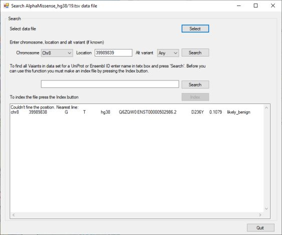

# AlphaMissenseViewer

AlphaMissenseViewer was created to allow the rapid searching of the AlphaMissense_hg19.tsv or AlphaMissense_hg38.tsv files for data specific to a possible mutation or are data linked to a gene or transcript. 

The data was produced using the AlphaMissense algorithm ([Github](https://github.com/google-deepmind/alphamissense)) and described in the [Science paper](https://www.science.org/doi/10.1126/science.adg7492).

## Getting the prebuilt program

The prebuilt program is located in the program folder. Due to security protocols set in place by Microsoft and some organisation's IT departments, downloading programs can be tricky. Consequently, the Program folder has an [help file](program/READMEmd) for downloading programs which may help. 

## Before you start

The search function works by performing a [binary search](https://en.wikipedia.org/wiki/Binary_search_algorithm) on the data file. To do this, the file must be decompressed using a program like 7zip or Windows 11's 'extract' function accessed via the menu that appears when you right click on a file. To search for possible variants in a gene or transcript, the file most first be indexed using the program's ```Index``` function.

## Downloading the data files

Currently the AlphaMissense data files are [here](https://console.cloud.google.com/storage/browser/dm_alphamissense;tab=objects?prefix=&forceOnObjectsSortingFiltering=false&pli=1) and can be downloaded by either clicking on the ```Tray``` icon on the right of the landing page or by selecting the file and then pressing the 'Download' button on the file specific page. Once downloaded extract the file using a program like 7zip or the inbuilt extraction function in newer Windows OS's.

## Selecting the (decompressed) data file

When started, the search buttons are disabled (Figure 1), to enable them you must enter a data file by pressing the ``Select`` button in the top right and select a data file. 

<hr />


Figure 1: User interface at start up
<hr />
Once a data file has been selected the 1st ``Search`` button will be activated, if no index file is found in the same folder the 2nd ``search`` button will be deactivated, but the ``Index`` button will be active and a red warning message will be displayed (Figure 2a). However, if ``AlphaMissenseViewer`` finds an index file, the the 2nd ``Search`` button will also be activated and the ``Index`` will be disabled and the red warning message will be hidden (Figure 2b).
<hr />


Figure 2a: User interface if no index file is found for the selected data file

<hr />


Figure 2b: User interface if an index file is found for the selected data file
<hr />


## Searching for data for specific variants/positions

To search for data at a specific genomic coordinate, select the chromosome from the first dropdown list and enter the genomic position in the text area (Figure 3a). Next either select the specific alternative allele from the right most dropdown list or if you aren't sure what it is select **Any** (Figure 3b) and press the ``Search`` button.
<hr />


Figure 3a: Entering a variant's genomic position<hr />


Figure 3b: Entering the variant's alternative allele<hr />

If a variant with the same alternative allele is present at the selected position it's data will be shown in the lower large text area (Figure 4a). If the variant position is not in the data set, you selected the reference allele for the alternative or the dataset doesn't contain data for the selected alternative allele at that position the nearest data line(s) will be shown in the text area. The nearest variant is the nearest in the file and not necessarily the nearest in the genome: if you are looking for the first variant on a chromosome it may display the last variant on the previous chromosome. Also, the data is organised by chromosome with the chromosome names ordered alphabetically so the order is more like Chr19, Chr1, Chr20 than Chr 1, Chr2 Chr3. 
<hr />


Figure 4a: The data displayed in the text area when a position was found<hr />



Figure 4b: The data for the nearest variant is displayed if ``AlphaMissenese`` doesn't fine the variant<hr />

## Searching for variants in a gene or transcript

The data for each analysed variant is linked to a UniProt protein and Ensembl transcript ID. To search for positions linked to a gene/transcript/protein, enter the relevant ID in the text area (Figure 5a) and press the 2nd ``Search`` button. If the ID is found the linked variant are displayed in the large lower text area (Figure 5b). If the ID is not found the text area is blank (Figure 5c). 
<hr />


Figure 5a: Entering a gene/transcript/protein ID in the 2nd text area<hr />


Figure 5b: Variants linked to a feature's ID<hr />


Figure 5c: The text area is blank if the ID is not found<hr />

### Making an index file

Select the data file you wish to index and press the ``Index`` button. ```AlphaMissenseViewer``` will read the file and when finished create an index file with the same name as the data file, but with the *.tsv file extension changed to *.index. Once made, the 2nd ``Search`` button should be activated and the red warning message will disappear.  
It's important to note that the locations in the index file are the locations for the entries in the data file and not genomic coordinates.<hr />


Figure 6: Indexing a data file<hr />

