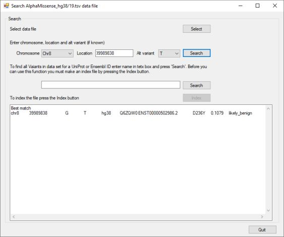

# AlphaMissenseViewer

AlphaMissenseViewer is designed to allow the rapid searching of the AlphaMissense_hg19.tsv or AlphaMissense_hg38.tsv files for the data for specific mutations or are possible variants in a gene or transcript. 

The data was produced using the AlphaMissense algorithm ([Github](https://github.com/google-deepmind/alphamissense)) and described in the [Science paper](https://www.science.org/doi/10.1126/science.adg7492).

## Before you start

The search function works by performing a [binary search](https://en.wikipedia.org/wiki/Binary_search_algorithm) on the data file. To do this, the file must be decompressed using a program like 7zip or Windows 11's decompression function. To search for possible variants in a gene or transcript, the file most first be indexed using the program's Index function.

## Downloading the data files

Currently the AlphaMissense data files are [here](https://console.cloud.google.com/storage/browser/dm_alphamissense;tab=objects?prefix=&forceOnObjectsSortingFiltering=false&pli=1) and can be downloaded by either clicking on the tray icon on the rigth of the landing page or by selecting the file and selecting the 'Download' button on the file specific page. Once downloaded extract the file using a program like 7zip or the inbuilt decomression function in newer Windows OS's.

## Selecting the (decompressed) data file

When started the search buttons are disabled (figure 1), to enable them press the ``Select`` button in the top right and select a data file. 

Figure 1: user interface at start up

Once a data file has been selected the 1st ``Search`` button will be activated, if no index file is found in the same folder the 2nd ``search`` button will be deactivated, but the ``Index`` button will be active and a red warning message will be displayed (Figure 2a). However, if ``AlphaMissenseViewer`` finds an index file the the 2nd ``Search`` button will also be activated and the ``Index`` will be inactive and the red warning message will be hidden (Figure 2b).

Figure 2a: User interface if no index file is found for the selected data file

Figure 2b: User interface if an index file is found for the selected data file

## Searching for data for specific variants/positions

To search for data at a specific genomic coordinate, select the chromosome from the first dropdown list and enter the genomic position in the text area (Figure 3a). Next either select the specific alternative allele from the right most dropdown list of if you aren't sure on the alternative allele select **Any** (Figure 3b) and press the ``Search`` button.

Figure 3a: Entering a variant's genomic position

Figure 3b: Entering the variant's alternative allele

If a variant at that position and with the same alternative allele is in the data set the linked data will be shown in the lower large text area (Figure 4a). If the variant position is not in the data set, you selected the reference allele for the alternative or the dataset doesn't contain data for the selected alternative allele at that position the nearest data line will be shown in the text area. The nearest variant is the nearest in the file and not necessarily the nearest in the genome: if you are looking for the first variant on a chromosome it may display the last variant on the previous chromosome. Also, the data is organised by chromosome with the chromosome names ordered alphabetically so the order is Chr19, Chr1, Chr20 rather than Chr 1, Chr2 Chr3. 

Figure 4a: The data displayed in the text area when a position was found

Figure 4b: The data for the nearest variant is displayed if ``AlphaMissenese`` doesn't fine the variant

## Searching for variants in a gene or transcript

The data for each analysed variant is linked to a UniProt protein and Ensembl transcript ID. To search for positions linked to gene/transcript/protein, enter the relevant ID in the text area (Figure 5a) and press the 2nd ``Search`` button. If the ID is found the linked variant positions are displayed in the large lower text area(Figure 5b). If the ID is not found the text area is cleared of any text (Figure 5c). 

Figure 5a: Entering a gene/transcript/protein ID in the 2nd text area

Figure 5b: Variants linked to a feature's ID.

Figure 5c

### making and index file

Select the data file you wish to index and press the ``Index`` button. ``AlphaMissenseViewer will read the file and when finished create an index file with the same name as the data file, but with the *.tsv file extension changed to *,index. Once made the 2nd ``Search`` button should be activated and the red warning message will disappear.  
It's important to note that the locations in the index file are the locations for the entries in the data file and not genomic coordintes.

Figure 6: Indexing a datafile

